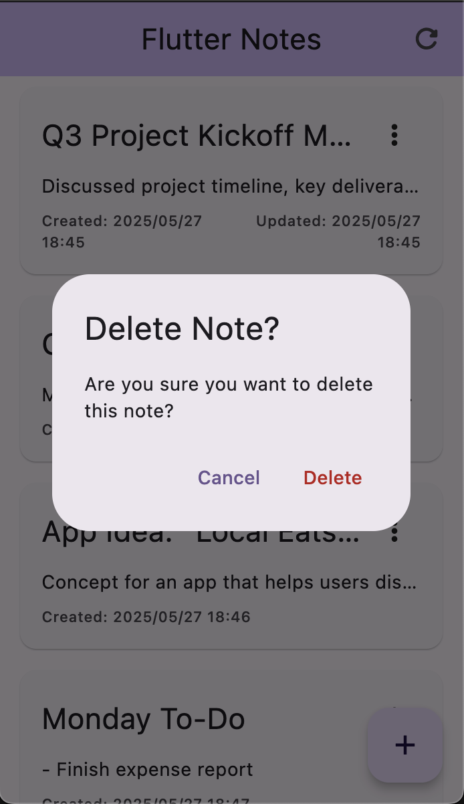

<div align="center"></div>

# Flutter Notes App

A simple note-taking application built with Flutter. This project makes use of best practices for Flutter architecture, state management, and API integration.

## Description

The Flutter Notes App allows users to create, view, and delete notes. Each note consists of a title and a description. The application is designed with a focus on a maintainable and scalable architecture.

In order to demonstrate error handling, the app includes a simulated API that has latency and can return errors a percentage of the time.

## Features

The application implements the following core functionalities across a minimal set of screens:

*   **View a list of notes:**
    *   **`NotesListPage`**: Displays all existing notes.
    *   Handles and displays loading, error, and empty states.

*   **Create a new note:**
    *   Users can navigate from the `NotesListPage` to an `AddEditNotePage`.
    *   **`AddEditNotePage`**: Provides input fields for a note's title and description.
  
*   **Delete a note:**
    *   Functionality to delete notes is available directly from the `NotesListPage`.

## Architecture


This project implements **Clean Architecture** principles to ensure a separation of concerns, making the application more testable, maintainable, and scalable. The architecture is divided into three main layers:

1.  **Presentation Layer:**
    *   Responsible for the UI and user interaction.
    *   Uses **BLoC (Business Logic Component)** for state management, handling events from the UI and emitting states to be rendered.
    *   Contains Widgets, Pages (Screens), and BLoCs.
  
2.  **Domain Layer:**
    *   Contains the core business logic and rules of the application.
    *   Includes Entities (business objects, e.g., `Note` entity), Use Cases (application-specific business rules, e.g., `GetAllNotes`, `CreateNote`), and Repository Contracts (abstract interfaces for data operations).
    *   This layer is independent of any framework or infrastructure details.
  
3.  **Data Layer:**
    *   Responsible for data retrieval and storage.
    *   Includes Repository Implementations (concrete implementations of the domain layer's repository contracts), Data Sources (which can be remote like an API or local like a database/mocked data), and Models (data transfer objects that might include serialization logic, e.g., `NoteModel`).
    *   API calls (Fetch all notes, Create/update a note, Delete a note) are mocked in this layer using `Future.delayed` or a similar mechanism.

**Dependency Injection:** `get_it` is used to manage dependencies between layers and components.

## Getting Started

### Prerequisites

To run this project, you need to have the following installed:
-   Flutter SDK 

### Running the App

To run the Flutter Notes App, follow these steps:
1.  Clone the repository:
    ```bash
        git clone
    ```

2.  Navigate to the project directory:
    ```bash
        cd flutter_notes_app
    ```

3.  Install dependencies:
    ```bash
        flutter pub get
    ```

4. Generate the necessary files:
    ```bash
        dart run build_runner build --delete-conflicting-outputs

        OR 

        flutter pub run build_runner build --delete-conflicting-outputs
    ```

5.  Run the application:
    ```bash
        flutter run
    ```

### Testing
To run tests, use the following command:
```bash
    flutter test
```

## Future Improvements

1.  Implement persistent storage for notes (e.g., using SQLite or shared preferences).
2.  Add unit tests for the `notes_list_page`, `note_card` and `injection_container`.
3.  Add internationalisation support and move all strings to an `.arb` file.
4.  Add GitHub Actions to run tests and dart analyze on every push.
5.  Add swipe to refresh functionality on the `NotesListPage`.

## Screenshots

<table>
  <tr>
    <td></td>
    <td></td>
    <td></td>
  </tr>
  <tr>
    <td></td>
    <td></td>
    <td></td>
  </tr>
  <tr>
    <td></td>
    <td></td>
    <td></td>
  </tr>
</table>

## Attribution

### Architecture

Thanks to [Reso Coder](https://resocoder.com/flutter-clean-architecture/) for the architecture diagram and the Clean Architecture principles used in this project.

### Icon

Sticky Note free icon designed by [Freepik](https://www.flaticon.com/free-icon/sticky-note_5942791?term=note) from [Flaticon](https://www.flaticon.com/). Generated for all platforms using [flutter_launcher_icons](https://pub.dev/packages/flutter_launcher_icons)